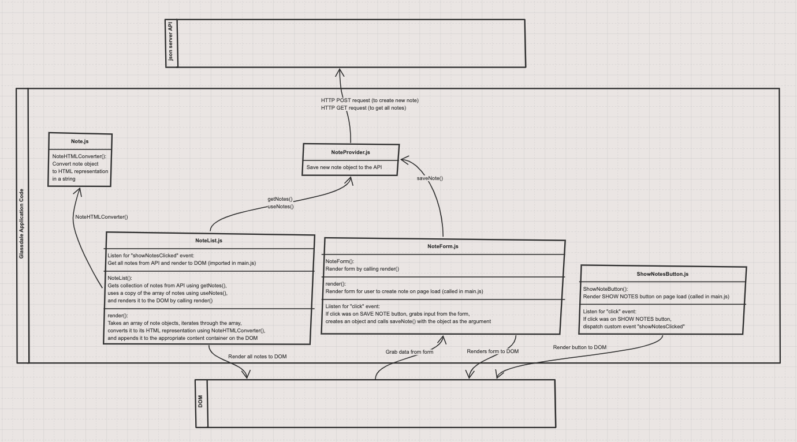
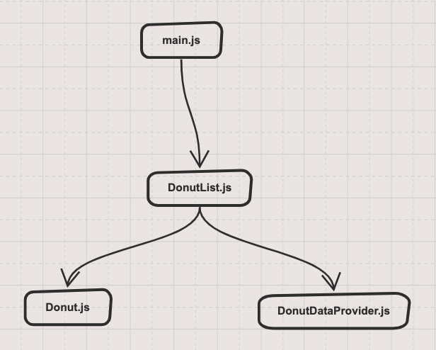

# Glassdale PD Web Application

## Instructions

1. Clone down this repo.
1. In a terminal window, `cd glassdale` and run your server: `serve`
1. In another terminal window, `cd glassdale/api` and run json-server: `json-server -p 8088 -w notes.json`
## Entity Relationship Diagram

[Glasdale ERD on dbdiagram](https://dbdiagram.io/d/60243d5680d742080a3a0cd3)

## Components and their interactions for Notes

## Components and their interactions for Donuts

